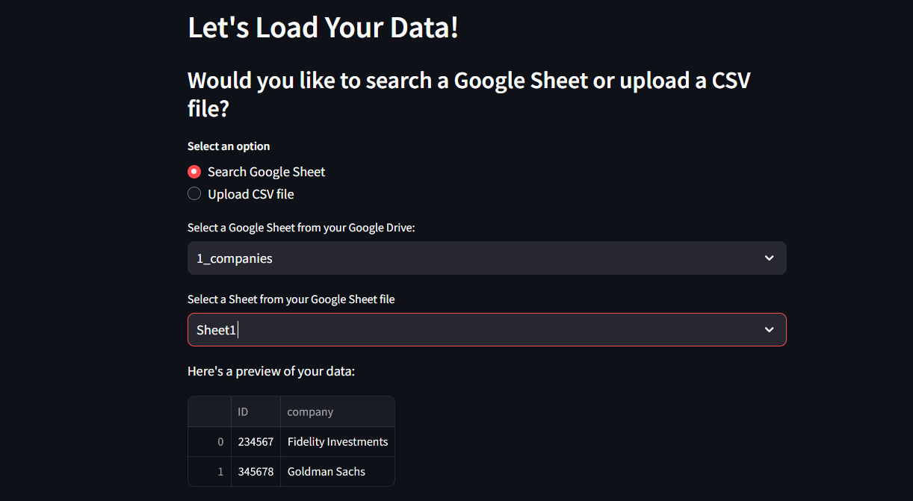
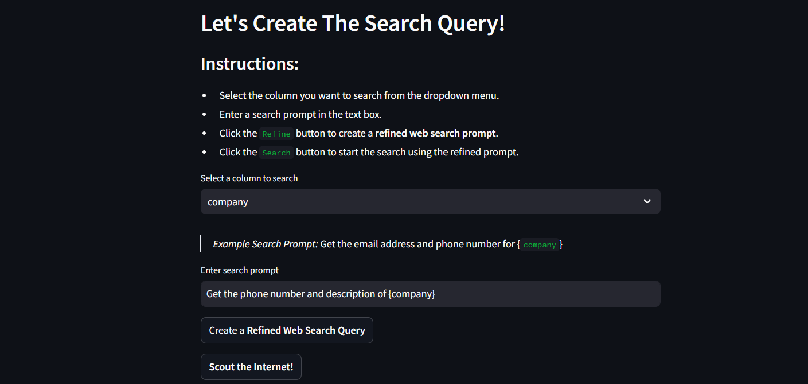
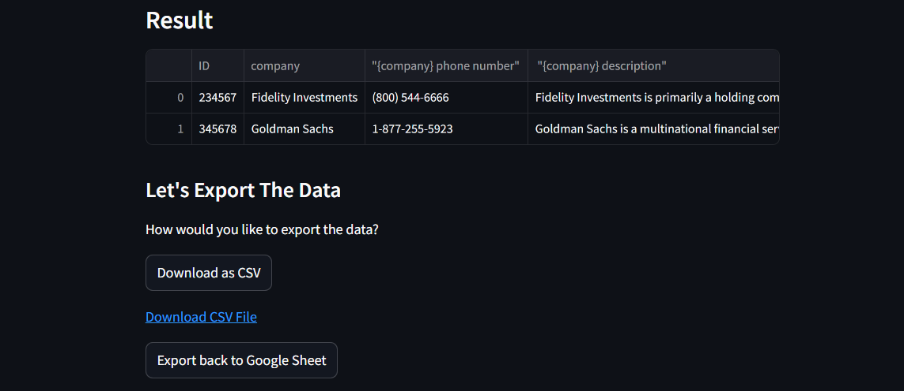

# DataScout: Intelligent Data Scraping with AI Precision


# What is DataScout?

## Overview
DataScout is an intelligent data scraping tool designed to streamline data retrieval and structured information extraction using AI-driven automation. It reads through an uploaded dataset, either from a CSV file or Google Sheets, and performs web searches based on custom prompts defined by the user. A Large Language Model (LLM) parses the results and extracts specific information for each entity, (such as company names), which is from a column selected by the user.

## Capabilities
- **Google Sheets Support**: Import and export your data directly from Google Sheets.
- **Custom Search Queries**: Define custom search prompts to tailor the data extraction process.
- **AI-Powered Search**: Utilize LLMs to refine search queries and extract precise information from the search results.
- **Parallel Processing**: Handles multiple search queries simultaneously.

## Use Cases
Datascout is a boilerplate for any custom data scraping project. Here are some things you can develop with DataScout:
- Retrieve company profiles, industry trends, and product information for competitors.
- Extract key data points like headquarters, CEO names, and recent financial highlights.
- Gather information on potential clients or partners from specific sectors or regions.
- Collect job openings, roles, and company hiring trends from public job boards.
- Analyze job descriptions to extract essential skills and qualifications.
- Collect data points from multiple sources for use in academic projects or reports.
- Collect and analyze reviews of specific products or services from online platforms.

## Setup and Usage

### Prerequisites
1. **Google Sheets API Client**
   - **Create a Google Cloud Project**:
     1. Go to [Google Cloud Console](https://console.cloud.google.com/).
     2. Create a new project by clicking the project dropdown and selecting **New Project**.
   - **Enable Google Sheets API**:
     1. In the Cloud Console, select **APIs & Services > Library**.
     2. Search for "Google Sheets API" and click **Enable** to add it to your project.
   - **Create a Service Account**:
     1. Go to **APIs & Services > Credentials**.
     2. Select **Create Credentials > Service Account** and fill in the details.
     3. Assign the **Editor** role for Google Sheets access, then **continue** and close.
     4. In the service account, go to the **Keys** tab, click **Add Key > Create New Key** and choose JSON. Save the JSON key file securely for later use.
   - **Share Your Google Sheet with the Service Account**:
     1. Copy the **service account email** from your JSON key file.
     2. Open your target Google Sheet, click **Share**, paste the email, and set it to **Editor** access.

2. **Google OAuth 2.0 Credentials**
   - Go to [APIs & Services > Credentials](https://console.cloud.google.com/apis/credentials) in the Google Cloud Console.
   - **Create OAuth Client ID**:
     1. Configure the **OAuth consent screen** (you only need to do this once).
     2. Under **Credentials**, click **Create Credentials > OAuth client ID**.
     3. Choose **Application type: Desktop app** or **Web application** as needed.
     4. Download the JSON file containing the OAuth 2.0 credentials.

3. **Search Engine API Key**
   - **Tavily API**:
     1. Visit the [Tavily website](https://app.tavily.com/), sign up for a new account.
     2. Go to **home page** and generate a new API key.
     3. Copy the key and save it securely; you’ll need it later for API integration.

4. **LLM API Key**
   - **Google AI Studio or Groq API**:
     1. Sign up at [Google AI Studio](https://aistudio.google.com/) or [Groq](https://www.groq.com/).
     2. Create a new project in the platform, navigate to the API settings, and generate an API key.
     3. Save the API key for connecting to the LLM.

5. **Python 3.7 or Higher**
   - Ensure Python 3.7 or a later version is installed. You can download it from [Python.org](https://www.python.org/downloads/).


### Setup Guide

1. **Clone the Repository:**
   ```bash
   git clone https://github.com/AhmedBaari/DataScout.git
   cd DataScout
   ```

2. **Install Dependencies:**
   ```bash
   pip install -r requirements.txt
   ```


3. **Set up API Keys and Environment Variables:**
   In the `.streamlit` directory, rename the `secrets.toml.example` file to `secrets.toml` and follow the instructions below.

   1. Enter your Google Gemini API key (or Groq API Key) and Tavily API key by getting them from the respective websites.
   ```toml
   GOOGLE_API_KEY="your gemini api key here"
   GROQ_API_KEY="or place the groq api key here"

   TAVILY_API_KEY="your tavily search api key here"
   ```

   2. Enter your Google Sheets API credentials and OAuth2.0 credentials by copying the respective JSON files' contents into the `secrets.toml` file. The email client json file may look like this: 
   ```json
   {
      "type": "service_account",
      "project_id": "datascout",
      "private_key_id": "",
      "private_key": "",
      "client_email": "ABC@X.iam.gserviceaccount.com",
      "client_id": "123",
      "auth_uri": "https://accounts.google.com/o/oauth2/auth",
      "token_uri": "https://oauth2.googleapis.com/token",
      "auth_provider_x509_cert_url": "https://www.googleapis.com/oauth2/v1/certs",
      "client_x509_cert_url": "https://www.googleapis.com/robot/v1/metadata/x509/X",
      "universe_domain": "googleapis.com"
   }
   ```
   Example of the corresponding part of `secrets.toml` file:
   ```toml
   type= "service_account"
   project_id= "datascout"
   private_key_id= ""
   private_key= ""
   client_email= "ABC@X.iam.gserviceaccount.com"
   client_id= "123"
   auth_uri= "https://accounts.google.com/o/oauth2/auth"
   token_uri= "https://oauth2.googleapis.com/token"
   auth_provider_x509_cert_url= "https://www.googleapis.com/oauth2/v1/certs"
   client_x509_cert_url= "https://www.googleapis.com/robot/v1/metadata/x509/X"
   universe_domain= "googleapis.com"
   ```

   3. Enter your Google OAuth2.0 credentials by copying the respective JSON file's contents into the `secrets.toml` file. The OAuth2.0 client json file may look like this:
   ```json
   {
      "web": {
         "client_id": "123",
         "project_id": "datascout",
         "auth_uri": "https://accounts.google.com/o/oauth2/auth",
         "token_uri": "https://oauth2.googleapis.com/token",
         "auth_provider_x509_cert_url": "https://www.googleapis.com/oauth2/v1/certs",
         "client_secret": "abc",
         "redirect_uris": ["http://localhost:8501", "http://localhost:8500"],
         "javascript_origins": ["http://localhost:8501", "http://localhost:8500"]
      }
   }
   
   ```
   Example of the corresponding part of `secrets.toml` file:
   ```toml
   client_id= "123"
   project_id= "datascout"
   auth_uri= "https://accounts.google.com/o/oauth2/auth"
   token_uri= "https://oauth2.googleapis.com/token"
   auth_provider_x509_cert_url= "https://www.googleapis.com/oauth2/v1/certs"
   client_secret= "abc"
   redirect_uris= ["http://localhost:8501", "http://localhost:8500"]
   javascript_origins= ["http://localhost:8501", "http://localhost:8500"]
   ```

4. **Run the Application:**
   ```bash
   streamlit run src/app.py
   ```

### Usage Guide
Here’s a **Usage Guide** section for your `README.md`, describing how to navigate and use the **DataScout** dashboard.

---

## Usage Guide

### Step 1: Load Your Data

1. **Choose Data Source**: Upon opening the dashboard, you’ll be prompted to select either:
   - **Google Sheets**: Connect directly to your Google Drive to select and import a Google Sheet.
   - **CSV File**: Upload a CSV file from your device.

2. **Preview Data**: Once the file is uploaded or Google Sheet is connected, a preview of your data will be displayed. Verify the data to ensure you have the correct file and columns.

### Step 2: Set Up Your Search Query

1. **Select Column**: From the dropdown menu, choose the primary column containing the entities you want to search (e.g., "Company" or "Product").

2. **Enter Search Prompt**: Define a custom search prompt to specify the type of information you want to retrieve. Use placeholders, such as `{company}`, to dynamically insert each entity name. 
   - **Example Prompt**: `Get the email address and description for {company}`.

3. **Refine Prompt**: Click the **Refine** button to let DataScout enhance the prompt, optimizing it for accurate search results.

4. **Start Search**: Click the **Scout the Internet** button to initiate the search. DataScout will conduct a web search for each entity based on the refined prompt, leveraging AI to extract the specific information.

### Step 3: View and Export Data

1. **View Results**: Once the search is complete, the extracted data will be displayed in a structured table on the dashboard.

2. **Export Options**:
   - **Download as CSV**: Download the results in a CSV format.
   - **Export to Google Sheets**: Send the results back to the connected Google Sheet, updating it with the newly extracted data.

3. **Confirmation**: After exporting, you will receive a confirmation message that your data has been successfully written to the chosen format.


## Contributing

Contributions are welcome! Open an issue or submit a pull request.