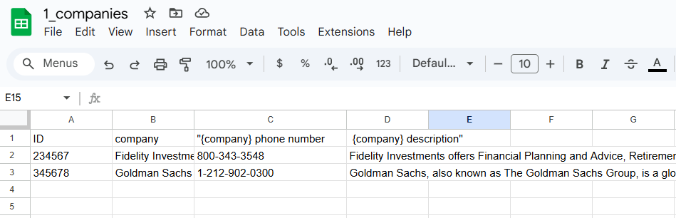

# DataScout: Intelligent Data Scraping with AI Precision


# What is DataScout?
<div style="position: relative; padding-bottom: 56.25%; height: 0;"><iframe src="https://www.loom.com/embed/0a7342173bc94c009eb51e52f2d0f532?sid=97e68ced-4ad9-4afd-a477-69ccb54a1987" frameborder="0" webkitallowfullscreen mozallowfullscreen allowfullscreen style="position: absolute; top: 0; left: 0; width: 100%; height: 100%;"></iframe></div>

---


## Overview
DataScout is an intelligent data scraping tool designed to streamline data retrieval and structured information extraction using AI-driven automation. It reads through an uploaded dataset, either from a CSV file or Google Sheets, and performs web searches based on custom prompts defined by the user. A Large Language Model (LLM) parses the results and extracts specific information for each entity, (such as company names), which is from a column selected by the user.

## Capabilities
- **Google Sheets Support**: Import and export your data directly from Google Sheets.
- **Custom Search Queries**: Define custom search prompts to tailor the data extraction process.
- **AI-Powered Search**: Utilize LLMs to refine search queries and extract precise information from the search results.
- **Parallel Processing**: Handles multiple search queries simultaneously.

## Use Cases
Datascout is a boilerplate for any custom data scraping project. Here are some things you can develop with DataScout:
- Retrieve company profiles, industry trends, and product information for competitors.
- Extract key data points like headquarters, CEO names, and recent financial highlights.
- Gather information on potential clients or partners from specific sectors or regions.
- Collect job openings, roles, and company hiring trends from public job boards.
- Analyze job descriptions to extract essential skills and qualifications.
- Collect data points from multiple sources for use in academic projects or reports.
- Collect and analyze reviews of specific products or services from online platforms.  


# Usage Guide
Live Demo: 
[](https://datascout.streamlit.app/)  

DataScout's user interface is super simple and intuitive. 
All of this is done in 3 simple steps:

### Step 1: Load Your Data

1. **Choose Data Source**: Upon opening the dashboard, you’ll be prompted to select either:
   - **Google Sheets**: Sign in with Google and then select the sheet from the dropdown menu.
   - **CSV File**: Upload a CSV file from your device.
   

1. **Preview Data**: Once the file is uploaded or Google Sheet is connected, a preview of your data will be displayed. Verify the data to ensure you have the correct file and columns.

### Step 2: Set Up Your Search Query

1. **Select Column**: From the dropdown menu, choose the primary column containing the entities you want to search (e.g., "Company" or "Product").

2. **Enter Search Prompt**: Define a custom search prompt to specify the type of information you want to retrieve. Use placeholders, such as `{company}`, to dynamically insert each entity name. 
   - **Example Prompt**: `Get the email address and description for {company}`.

3. **Refine Prompt**: Click the **Refine** button to let DataScout enhance the prompt, optimizing it for accurate search results.

4. **Start Search**: Click the **Scout the Internet** button to initiate the search. DataScout will conduct a web search for each entity based on the refined prompt, leveraging AI to extract the specific information.

### Step 3: View and Export Data

1. **View Results**: Once the search is complete, the extracted data will be displayed in a structured table on the dashboard.

2. **Export Options**:
   - **Download as CSV**: Download the results in a CSV format.
   
  
   - **Export Back to Google Sheet**: Send the results back to the connected Google Sheet, updating it with the newly extracted data.
   
  

3. **Confirmation**: After exporting, you will receive a confirmation message that your data has been successfully written to the chosen format.


# Self-Hosting Guide
## Required API Clients and Credentials


### 1. Google Sheets API Client
#### Step 1: Create a Google Cloud Project
   - Go to [Google Cloud Console](https://console.cloud.google.com/).
   - Select the project dropdown and click **New Project** to create a new project.

#### Step 2: Enable Google Sheets API
   - Navigate to **APIs & Services > Library** in the Cloud Console.
   - Go to [Google Sheets API](https://console.cloud.google.com/marketplace/product/google/sheets.googleapis.com) and select **Enable**.
   

#### Step 3: Create a Service Account
   - Go to **APIs & Services > Credentials**.
   - Select **Create Credentials > Service Account**, fill in the required details, and assign the **Editor** role for Sheets access.
   
   - In the **Keys** tab of your service account, select **Add Key > Create New Key**, choose JSON, and download the key file securely for later use.
   


---

### 2. Google OAuth 2.0 Credentials
   - Open [APIs & Services > Credentials](https://console.cloud.google.com/apis/credentials) in the Google Cloud Console.
   - **Create OAuth Client ID**:
      1. Configure the **OAuth consent screen** (only required once).
      
      2. Under **Credentials**, select **Create Credentials > OAuth client ID**.
      3. Select **Web application** as the application type.
      
      4. Under **Authorized redirect URIs**, add `http://localhost:8501` and `http://localhost:8500` (or any other URIs that you might be using for DataScout).
      
      5. Download the JSON file containing your OAuth 2.0 credentials.

---

### 3. Search Engine API Key (Tavily API)
   - Sign up on the [Tavily website](https://app.tavily.com/).
   - From the home page, generate a new API key and save it securely for future integration.

---

### 4. LLM API Key
   - Visit [Google AI Studio](https://aistudio.google.com/) or [Groq](https://www.groq.com/).
   - Sign up, create a new project, and navigate to API settings to generate an API key.
   - Save this API key securely for connecting to the LLM.

---

### 5. Python Installation
   - Ensure Python 3.7 or a later version is installed on your system. [Download Python](https://www.python.org/downloads/) if needed.


## Setup Guide

1. **Clone the Repository:**
   ```bash
   git clone https://github.com/AhmedBaari/DataScout.git
   cd DataScout
   ```

2. **Install Dependencies:**
   ```bash
   pip install -r requirements.txt
   ```


3. **Set up API Keys and Environment Variables:**
   In the `.streamlit` directory, rename the `secrets.toml.example` file to `secrets.toml` and follow the instructions below.

   1. Enter your Google Gemini API key (or Groq API Key) and Tavily API key by getting them from the respective websites.
   ```toml
   GOOGLE_API_KEY="your gemini api key here"
   GROQ_API_KEY="or place the groq api key here"

   TAVILY_API_KEY="your tavily search api key here"
   ```

   2. Enter your Google Sheets API credentials and OAuth2.0 credentials by copying the respective JSON files' contents into the `secrets.toml` file. The email client json file may look like this: 
   ```json
   {
      "type": "service_account",
      "project_id": "datascout",
      "private_key_id": "",
      "private_key": "",
      "client_email": "ABC@X.iam.gserviceaccount.com",
      "client_id": "123",
      "auth_uri": "https://accounts.google.com/o/oauth2/auth",
      "token_uri": "https://oauth2.googleapis.com/token",
      "auth_provider_x509_cert_url": "https://www.googleapis.com/oauth2/v1/certs",
      "client_x509_cert_url": "https://www.googleapis.com/robot/v1/metadata/x509/X",
      "universe_domain": "googleapis.com"
   }
   ```
   Example of the corresponding part of `secrets.toml` file:
   ```toml
   type= "service_account"
   project_id= "datascout"
   private_key_id= ""
   private_key= ""
   client_email= "ABC@X.iam.gserviceaccount.com"
   client_id= "123"
   auth_uri= "https://accounts.google.com/o/oauth2/auth"
   token_uri= "https://oauth2.googleapis.com/token"
   auth_provider_x509_cert_url= "https://www.googleapis.com/oauth2/v1/certs"
   client_x509_cert_url= "https://www.googleapis.com/robot/v1/metadata/x509/X"
   universe_domain= "googleapis.com"
   ```

   3. Enter your Google OAuth2.0 credentials by copying the respective JSON file's contents into the `secrets.toml` file. The OAuth2.0 client json file may look like this:
   ```json
   {
      "web": {
         "client_id": "123",
         "project_id": "datascout",
         "auth_uri": "https://accounts.google.com/o/oauth2/auth",
         "token_uri": "https://oauth2.googleapis.com/token",
         "auth_provider_x509_cert_url": "https://www.googleapis.com/oauth2/v1/certs",
         "client_secret": "abc",
         "redirect_uris": ["http://localhost:8501", "http://localhost:8500"],
         "javascript_origins": ["http://localhost:8501", "http://localhost:8500"]
      }
   }
   
   ```
   Example of the corresponding part of `secrets.toml` file:
   ```toml
   client_id= "123"
   project_id= "datascout"
   auth_uri= "https://accounts.google.com/o/oauth2/auth"
   token_uri= "https://oauth2.googleapis.com/token"
   auth_provider_x509_cert_url= "https://www.googleapis.com/oauth2/v1/certs"
   client_secret= "abc"
   redirect_uris= ["http://localhost:8501", "http://localhost:8500"]
   javascript_origins= ["http://localhost:8501", "http://localhost:8500"]
   ```

4. **Run the Application:**
   ```bash
   streamlit run src/app.py
   ```

## Contributing

Contributions are welcome! Open an issue or submit a pull request.